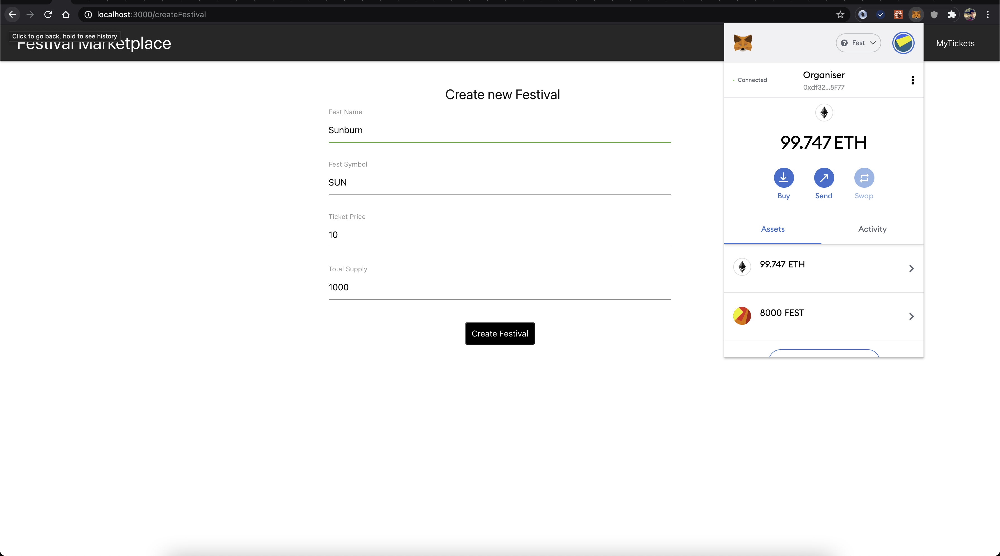
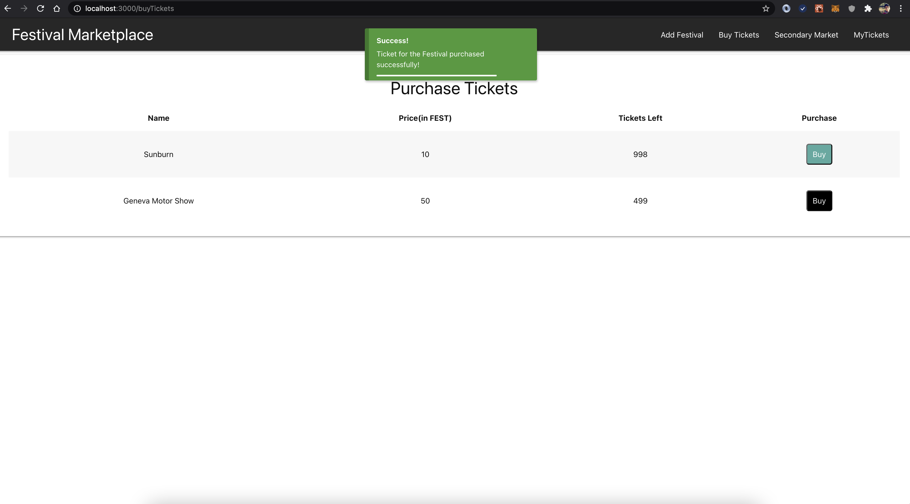
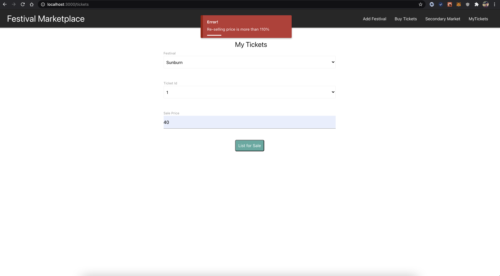
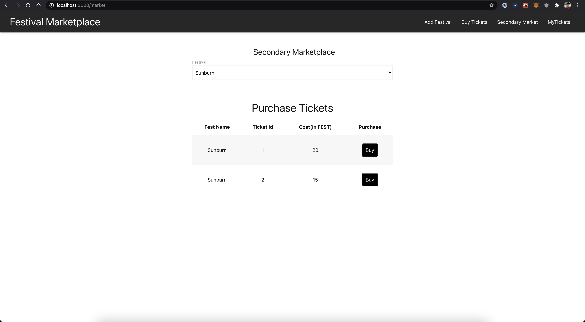

# Festival Marketplace

### Overview 
An end-to-end blockchain based platform for festival ticket booking and ticket reselling between trustless parties. This will help to eliminate the current issue with the fake tickets and uncontrolled resale price for the tickets in black market. The platform is build on public Ethereum blockchain network where ERC721 tokens represent festival tickets and these tickets can be purchased using a platform based ERC20 token called FEST.

### Functionality
1. An organiser can create a new fest for ticket distribution with specified ticket price and the total supply of tickets for the sale.
2. Once the festival is hosted on the platform, the customers have ablility to purchase the tickets directly from the organiser.
3. The customer can view the tickets they own for the available festival.
4. The customer have ability to sell the tickets they own either via the secondary market or directly to the peer customer, but the price at which customer can sell the ticket can not be more than 110% of the purchase price.
5. Tickets being sold through the secondary market adds a commission of 10% to the organiser which is deducted from the selling price the seller has listed.

### Technical Details
##### Smart Contract
Mainly 4 contracts listed under `./contracts` directory.
1. **FestToken** - 
    1. A contract for ERC20 token called FEST which is used to purchase tickets.
2. **FestivalNFT** - 
    1. A contract for ERC721 tokens to represent festival tickets.
    2. The owner of the contract will also have minter role and only the owner can mint new tickets.
3. **FestivalMarketplace** - 
    1. A contract which acts as a marketplace for purchasing tickets from organiser and through secondary market.
    2. This contract will act as a delegate approver for the FEST token as well as NFT token transfers.
4. **FestiveTicketsFactory** - 
    1. A contract which implements a factory pattern with FestivalNFT contract to create new festivals on the fly.

##### React application
Listed under `./client` directory.
1. All the react components are listed under `./client/src/components` directory.
2. All the smart contract instance creation are listed under `./client/src/proxies` which implements singleton pattern.

#### How it works?

###### Creating new festival
1. The organiser creates a new festival by minting tickets using `bulkMintTickets()` of `FestivalNFT` smart contract. The minted tickets are assigned to `FestivalMarketplace` smart contract.

###### Purchase tickets from organiser
1. When customer initiates purchase from organiser, the application first sets the ticket price as the allowance of `FestivalMarketplace` contract for the customer's FEST tokens. 
2. Then the application initiates the `purchaseTicket()` of `FestivalMarketplace` contract which transfers the FEST tokens from customer to the organiser and then transfers the next sale ticket from `FestivalMarketplace` contract to the customer.

###### Selling tickets on secondary market
1. When customer wish to list ticket for sale on secondary market of the platform, the application initiates the `setSaleDetails()` of `FestivalNFT` contract which gives permission to `FestivalMarketplace` contract to transfer ticket token to the customer who will be purchasing the ticket.

###### Purchasing tickets from secondary market
1. When customer initiates purchase from secondary market, the application first sets the ticket selling price as the allowance of `FestivalMarketplace` contract for the customer's FEST tokens. 
2. Then the applicaiton initiates the `secondaryPurchase()` of `FestivalMarketplace` contract which transfers the 10% commission as FEST tokens from customer to the organiser and rest amount to the seller and transfers the ticket token from seller to buyer.

###### Selling tickets peer to peer
1. When customer wish to sell the ticket directly to another customer, the customer has to initiates `secondaryTransferTicket()` of `FestivalNFT` contract which restricts the customer from transfering ticket if the selling price is higher than 110%.

### Running the application
##### Prerequisite
1. Docker
2. Metamask plugin for browser

##### Steps
1. Clone the project.
2. Start the docker application.
3. Run the below command from the root directory to run the ethereum client and deploy the smart contracts to the network.
    ```sh
    docker-compose up --build
    ```
4. Note down first couple of private keys from the output logs.
5. Note down the FestToken contract address.
4. Run the below command from `./client` directory to run the react application.
    ```sh
    docker-compose up --build
    ```
5. React application will be accessible at `http://localhost:3000/`.
6. Configure the Metamask with RPC url `http://0.0.0:8545`.
7. Import the accounts in the metamask by taking 1st private key from step 4 and setting it as an organiser. Add couple more accounts in metamask to act as a customers.
8. Add new FEST token in metamask using the contract address from step 5.
9. Transfer some amount of FEST tokens from organiser to other cutomers using metamask for testing the application.
10. Set up is completed and now the organiser account will be able to add new festival and customers will be able to purchase/sell the tickets.

### Future Roadmap
##### Tech debt
1. Add clone factory pattern (ERC1167 implementation) for the FestiveTicketsFactory smart contract which uses delegate calls to save the gas cost for the contract deployment.
2. Reduce the gas consumption for the the bulk minting of tickets. Once solution to do is to modify the openzeppelin's ERC721 contract such that its constructor will be able to directly initialize the required values to its state variables instead of updating the state variable again and again which consumes more gas than operating on memory.
3. Add unit test cases covering all the scenarios.

##### Feature debt
1. Add one click login option using metamask and add public and private routes.
2. Add option to burn the ERC721 token during check in.
3. Add option to withdraw tickets from sale.

### Screenshots





